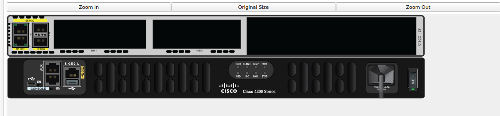

## switch

el switch tiene una tabla de aprendizaje de direcione mac

|puerto|MAC|
-|-
...|...
2|0.0.0.0

tabla de aprendizajede router.Tiene entradas amarillas (gibabit eternet), azules(consola) y negras (aux)

|interfaz|red|
-|-
Gibit 1|red 1 red 2 ...
Gibit 2|... ...

A nivel de capa 2 todas las computadoras pueden estar en el mismo entorno físico. Pero no estar conectadas, para conecetar las redes es necesario un router

- Conectar redes *ROUTER*
- conectar computadoras *SWITCH*

### Configurar ROUTER

- enable -> entrar privilegiado
- show running-config ->ver configuración de router

